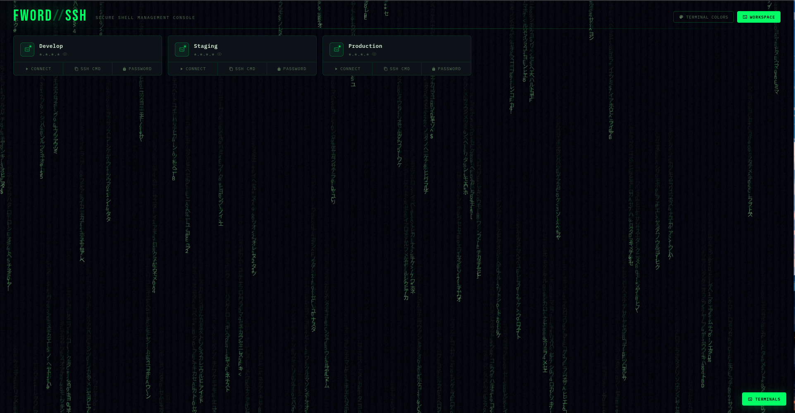
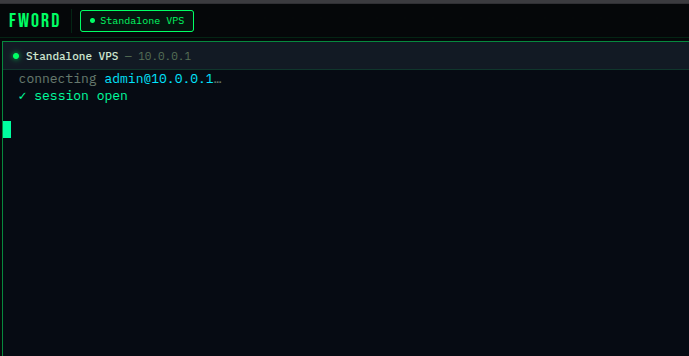
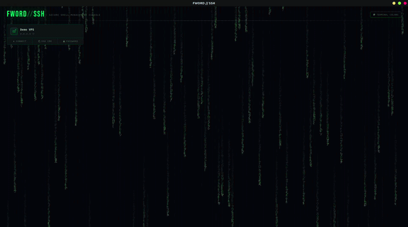

# FWORD SSH

> Manage encrypted local SSH connections with an HTML / Node.js app.  
> You can inspect every line of code — no backdoors, no telemetry. 🙂
>
> 🔍 **Independent audit available:** see [SECURITY-AUDIT.md](SECURITY-AUDIT.md) for a full line-by-line analysis confirming that the app is 100 % local with no external network calls, no CDN, and no telemetry.






---

## Supported OS

| Platform | Browser mode | Desktop (Electron) |
|----------|-------------|-------------------|
| **Linux**  | ✅ | ✅ AppImage |
| **macOS**  | ✅ | ✅ DMG |

---

## Features

- **In-browser SSH terminal** — Connect to any server directly from the browser via a live xterm.js / WebSocket session (port 5556)
- **Multi-tile workspace** — Multiple SSH sessions open simultaneously with automatic tiling layout (1 → 2 → grid)
- **Drag-to-swap** — Drag any terminal tile onto another to swap positions
- **Fullscreen tile** — Expand a single terminal to fill the workspace and restore it back
- **Session pills** — Quick-switch between open terminals from the top bar
- **Terminal color palette** — 5 built-in themes (Fword Dark, Dracula, Nord, Gruvbox, Tokyo Night) + full 18-color customizer with live hex editing; save unlimited custom palettes to localStorage
- **IP reveal toggle** — Server IPs are masked by default; click the eye icon to reveal/hide
- **SSH command copy** — Copy `ssh user@host` to clipboard in one click
- **Encrypted passwords** — Passwords are AES-256-CBC encrypted with a magic salt; the salt is required each time you copy a password
- **Hacker rain background** — Animated matrix-style katakana / hex rain canvas
- **Fully offline** — xterm.js, xterm-addon-fit, browser-crypto and all fonts are bundled locally — no CDN requests at runtime

---

## Asset structure

```
assets/
  css/
    index.css               # app styles
    xterm.css               # terminal stylesheet (local)
    google-fonts.css        # self-hosted font faces
  fonts/                    # woff2 files (IBM Plex Mono, Bebas Neue, Syne)
  js/
    index.js                # app logic
    xterm.js                # xterm.js v5.3.0 (local)
    xterm-addon-fit.js      # fit addon (local)
    browser-crypto.min.js   # AES-256-CBC decryption (local)
  json/
    content.json            # server list
electron-main.js            # Electron entry point
bash.js                     # Node backend (WebSocket SSH bridge, port 5556)
server.js                   # Standalone HTTP server (browser mode)
```

## JSON Configuration Format

The `assets/json/content.json` file stores SSH server configurations in JSON format. The structure supports both individual servers and grouped servers.

### Basic Structure

The file contains an array of server objects. Each object can be either:
1. An individual server
2. A group containing multiple servers

**Display Order:** Grouped servers are displayed before standalone servers in the interface.

### Individual Server Format

```json
{
  "server": "server-name",
  "ip": "192.168.1.100",
  "user": "username",
  "pwd": "encrypted-password"
}
```

### Grouped Servers Format

```json
{
  "groupName": "Group Display Name",
  "nestedServers": [
    {
      "server": "server-1",
      "ip": "192.168.1.101",
      "user": "user1",
      "pwd": "encrypted-password-1"
    },
    {
      "server": "server-2",
      "ip": "192.168.1.102",
      "user": "user2",
      "pwd": "encrypted-password-2"
    }
  ]
}
```

### Field Descriptions

| Field | Type | Description |
|-------|------|-------------|
| `server` | string | Display name for the server (appears in UI) |
| `ip` | string | IP address or hostname of the server |
| `user` | string | SSH username |
| `pwd` | string | AES-256-CBC encrypted password (format: `iv:ciphertext`) |
| `groupName` | string | Display name for a server group (only for grouped servers) |
| `nestedServers` | array | Array of server objects within a group |

### Password Encryption

Passwords are encrypted using AES-256-CBC with a magic salt. The encrypted format is:
```
iv:ciphertext
```
Where:
- `iv` = 32-character hex initialization vector
- `ciphertext` = 32-character hex encrypted password

### Example Configuration

```json
[
  {
    "groupName": "Production Servers",
    "nestedServers": [
      {
        "server": "Web Server",
        "ip": "192.168.1.10",
        "user": "admin",
        "pwd": "578a860634c20f818deb1deb9fb64dc6:aefa41239198973d52a916761248aeb9"
      },
      {
        "server": "Database Server",
        "ip": "192.168.1.11",
        "user": "dbadmin",
        "pwd": "800b65903f70739163cb5fae7f511fa1:b7a0b2b5904a2385d349a46ee99fced9"
      }
    ]
  },
  {
    "groupName": "Staging Environment",
    "nestedServers": [
      {
        "server": "Staging App",
        "ip": "192.168.1.30",
        "user": "staging",
        "pwd": "a1b2c3d4e5f6a7b8c9d0e1f2a3b4c5d6e7:f8e9d0c1b2a3f4e5d6c7b8a9f0e1d2c3"
      }
    ]
  },
  {
    "server": "Development Server",
    "ip": "192.168.1.20",
    "user": "dev",
    "pwd": "c45f3b8a9e2d7a1f0b4c6d8e3f2a1b9c:8d7e6f5a4b3c2d1e0f9a8b7c6d5e4f3a2"
  },
  {
    "server": "Backup Server",
    "ip": "192.168.1.40",
    "user": "backup",
    "pwd": "d5e6f7a8b9c0d1e2f3a4b5c6d7e8f9a0b1:c2d3e4f5a6b7c8d9e0f1a2b3c4d5e6f7"
  }
]
```

---

## Browser mode (Linux & macOS)

Runs the app as a regular website served by Node.js — no Electron needed.

### Requirements

- Node.js ≥ 18
- Nodemon (global)
- A web server pointing at this directory (Nginx / Apache / etc.) **or** use the built-in server

```bash
sudo yarn -g nodemon
```

> The app always uses **port 5556** for its WebSocket SSH bridge.

### Install

Clone into your web server's publish directory (default `/var/www/html`).  
If you use a different path, edit lines 5 & 11 in the `fwordssh` file.

```bash
bash install.sh
```

### Usage

```bash
# Install Node dependencies
yarn

# Start the backend
fwordssh app

# Add a new SSH host
fwordssh add
```

---

## Desktop app — Linux (Electron → AppImage)

### Prerequisites

```bash
# Node.js ≥ 18 + npm/yarn
sudo apt install nodejs npm          # Debian/Ubuntu
# or
sudo pacman -S nodejs npm            # Arch

# Yarn (used by the build scripts)
npm install -g yarn

# Native build tools required by node-pty
sudo apt install build-essential python3   # Debian/Ubuntu
# or
sudo pacman -S base-devel python           # Arch
```

### Build

```bash
# 1. Install dependencies
yarn

# 2. Build the AppImage
yarn build:linux
# Output: dist/FWORD SSH-*.AppImage
```

### Install to app launcher (optional)

```bash
bash install-desktop.sh
# Registers a .desktop file and installs the AppImage to ~/.local/bin
# so FWORD SSH appears in GNOME / KDE / XFCE app launchers
```

### Uninstall desktop integration

```bash
bash uninstall-desktop.sh
```

### Run without installing

```bash
chmod +x "dist/FWORD SSH-*.AppImage"
./dist/FWORD\ SSH-*.AppImage
```

---

## Desktop app — macOS (Electron → DMG)

### Prerequisites

```bash
# Node.js ≥ 18 (recommended via nvm or Homebrew)
brew install node

# Yarn
npm install -g yarn

# Xcode Command Line Tools (required for node-pty native compilation)
xcode-select --install
```

### Build

```bash
# 1. Install dependencies
yarn

# 2. Build the DMG
yarn build:mac
# Output: dist/FWORD SSH-*.dmg
```

### Install

```bash
open dist/FWORD\ SSH-*.dmg
# Drag FWORD SSH.app to /Applications in the installer window
```

### Uninstall

```bash
# Drag FWORD SSH.app from /Applications to the Trash
# or:
rm -rf /Applications/FWORD\ SSH.app
```

---

## Development (Electron with hot-reload)

```bash
npm install

# Terminal 1 — backend with auto-restart
nodemon bash.js

# Terminal 2 — Electron window
npm run electron:dev    # opens DevTools via --inspect=5858
```

---

## Have a good time hacking!
