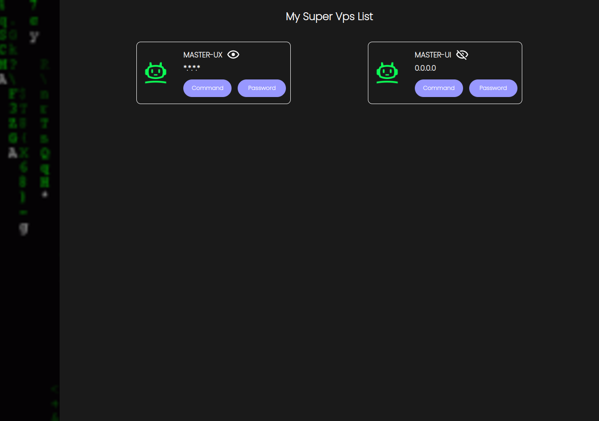

# free-html-local-ssh-manager (3 minutes install)
Manage encrypted local ssh connections with HTML/Nodejs app ~ You can inspect the code and won't find any backdoor! :) <br>

# Screen


# Supported Os
Linux | MacOs

# Fonctionnalities & Some ideas :)
Once you click on "command" button, a terminal is launched with ssh command to remote host. Your password is encrypted with a magic salt once you create a new host and you need that magic salt every time you click on password button which will copy/paste the host password in your clipboard from the browser. It can be a collaborative free tool to share access to multiple servers. Password Protected page can also be added! 

It works perfectly with ssh-keys managed cloud VPS!

# Requirements

1 - Nodemon installed globally
```bash
 sudo npm install -g nodemon
```

2 - Web Server (Nginx or Apache or whatever you like that reads website by folders)

Note : App uses port 5556

# Installation
Clone repository in the publish directory of your web server (by default /var/www/html if not you must edit line 5 & 11 in "fwordssh" file from this repository to set the path to the directory where you cloned it.)

```bash
 bash install.sh
```

# Instructions

1 - Install npm packages
```bash
 npm install
```

2 - Run app (Just like your regular linux command :) )
```bash
 fwordssh app
```

3 - Add a new host (Just like your regular linux command :) )
```bash
 fwordssh add
```

# Have a good time hacking!
